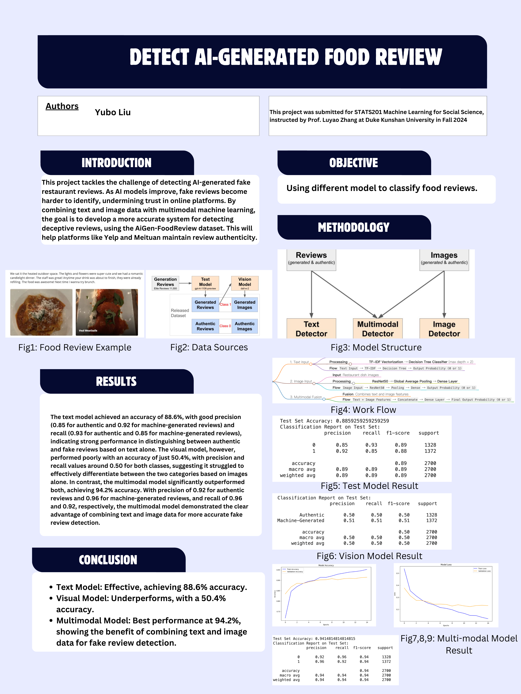

# Detecting AI-Generated Fake Restaurant Reviews Using Multimodal Machine Learning

## Table of Contents
- [Project Overview](#project-overview)
- [Code Execution](#code-execution)
- [Datasets and Preprocessing](#datasets-and-preprocessing)
- [Acknowledgments](#acknowledgments)
- [Intellectual and Professional Growth](#statement-of-intellectual-and-professional-growth)

## Authors
- **Yubo Liu**: Project Lead and Developer

## Disclaimer
This project was submitted for **STATS201 Machine Learning for Social Science**, instructed by **Prof. Luyao Zhang** at **Duke Kunshan University** in **Fall 2024**. The purpose of this project is to explore the detection of fake restaurant reviews generated by AI using multimodal machine learning techniques.

## Acknowledgments
- **Prof. Luyao Zhang** for her guidance and support throughout the course.
- Classmates for their collaborative spirit and insightful feedback during discussions.
- Open-source software, including **TensorFlow**, **scikit-learn**, and **pandas**, for providing the tools necessary to complete this project.
- **AIGC tools** that were helpful in generating ideas and content for this research.

## Statement of Intellectual and Professional Growth
This project has significantly contributed to my intellectual and professional growth. Throughout the course, I have gained a deeper understanding of machine learning techniques, particularly in the areas of natural language processing (NLP) and computer vision. This project also enhanced my ability to integrate multimodal data, combining text and images, to solve real-world problems. Moreover, working on this project has refined my skills in model development, evaluation, and data preprocessing, preparing me for future challenges in the field of data science and machine learning.

## Embedded Media
- **[Project Poster](https://www.canva.com/design/DAGYC2A2ZRQ/Vq840u5mFhpvdamGhum6tQ/edit?utm_content=DAGYC2A2ZRQ&utm_campaign=designshare&utm_medium=link2&utm_source=sharebutton)**
- **[Demo Video](https://urldefense.com/v3/__https://duke.zoom.us/rec/share/jgoqy90pu9TP9viixDMKCY_psits56IzzDReRE88ExpG4YHZgsjvwbVavtNf90c_.t9C96CKzoMukt3gI__;!!OToaGQ!qHbYvC4_etXfp9V5UC1qfdPX-gFg7qUOGHZlVdKNp_jUsqVTPKXjtTqer1mp_Ln-mW5hYNrGteFIUznoa6E$)**

## Code Execution

To run the code and reproduce the results, follow these steps:

### 1. Download all the ipynb files and dataset and unzip the image.zip

### 2. Run the ipynb files in a python environment, refer to the following for dependency:
pandas==1.5.3
scikit-learn==1.2.1
numpy==1.23.5
tensorflow==2.11.0
matplotlib==3.6.3
python-dotenv==1.0.0

