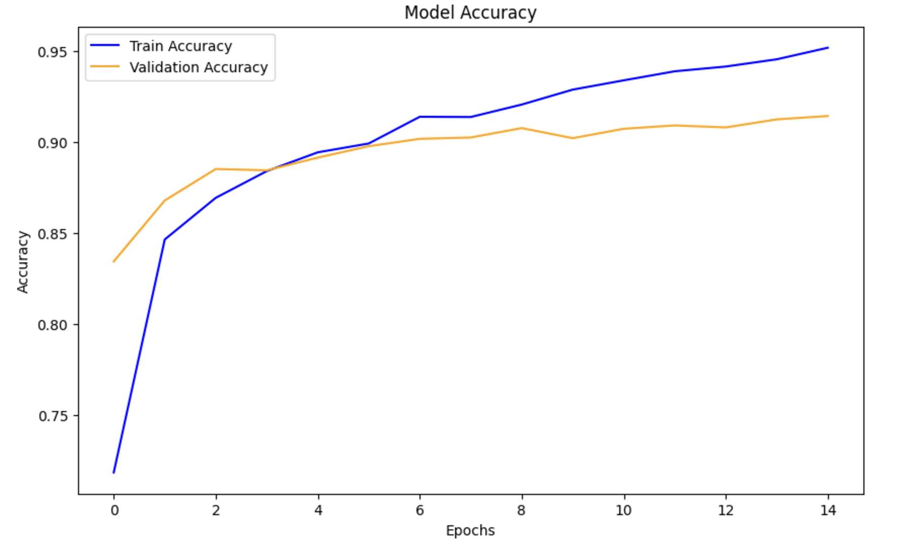
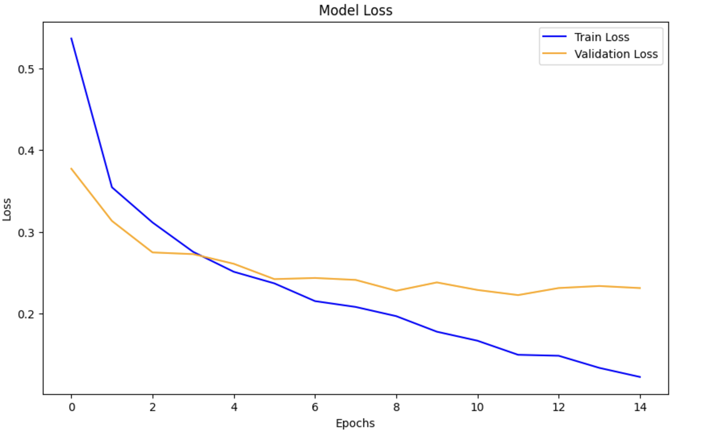
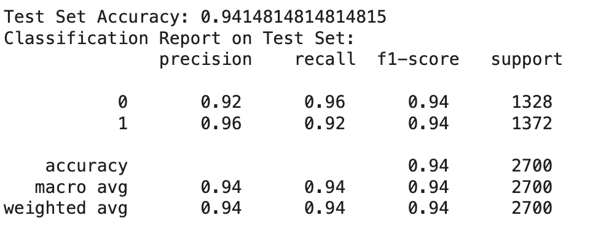
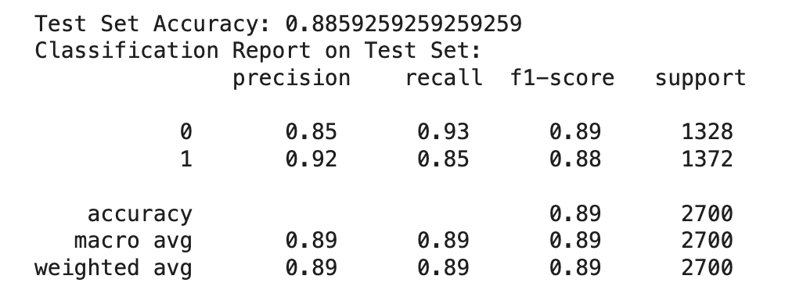
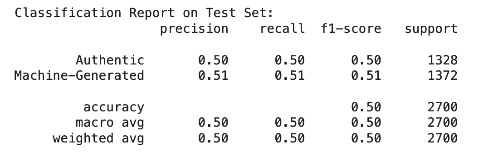

# Visualizations Folder

## Overview

This folder contains visualizations generated during the training and evaluation of the multimodal model. The visualizations provide insights into the performance and progress of the model across training epochs, as well as a summary of the final results. These include plots showing accuracy and loss changes during training, as well as the final classification results from the multimodal, text, and visual models.

The following visualizations are included:

- **Accuracy Change During Training**: Shows how the accuracy of the multimodal model evolved during training.
- **Loss Change During Training**: Illustrates how the loss decreased over time for both the training and validation sets.
- **Final Results of Multimodal Model**: Displays the final classification results of the multimodal model.
- **Text Model Results**: Results specifically from the text-based model.
- **Visual Model Results**: Results from the visual-based model.

## Visualizations

### 1. **Accuracy Change During Training**
This plot illustrates the change in accuracy of the multimodal model over multiple training epochs, both for the training and validation datasets. It helps track whether the model is improving and generalizing well.

### 2. **Loss Change During Training**
This plot tracks the loss value during the training of the multimodal model. It shows the progression of the loss during training and validation epochs, which helps to identify overfitting or underfitting.

### 3. **Final Results of Multimodal Model**
This image summarizes the final results of the multimodal model, showing its classification performance on the test dataset. It provides a detailed view of how the multimodal model performed in detecting fake reviews.

### 4. **Text Model Results**
This visualization presents the results from the text-based model, offering insights into how the text features alone contribute to fake review detection.

### 5. **Visual Model Results**
This image shows the results from the visual model, highlighting how the visual features extracted from images contribute to detecting fake reviews.

## Additional Notes

- The **accuracy** and **loss** plots help to visualize the performance of the multimodal model throughout the training process, highlighting potential issues like overfitting.
- The **final results** images provide a clear summary of how well the multimodal, text, and visual models performed in distinguishing between authentic and fake reviews.
- These visualizations were created to provide a better understanding of the model's training progress and its overall performance in detecting fake reviews using both text and image features.

These visualizations offer valuable insights into model performance and help identify areas for further optimization.
